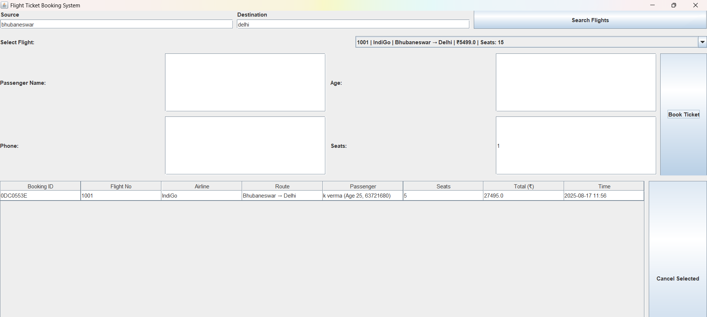
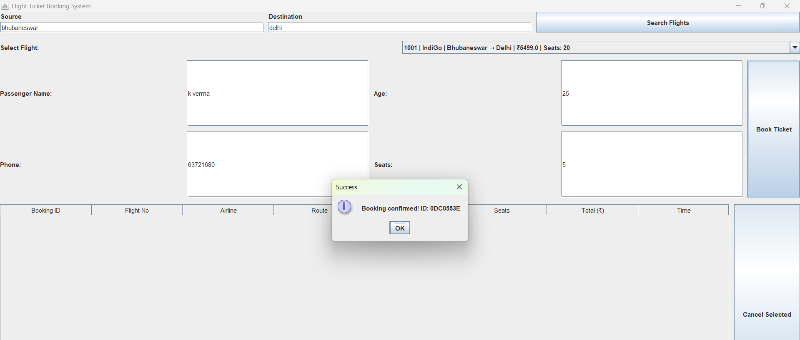

# ✈ Flight Booking System  

A simple yet stylish *Java-based Flight Booking System* with a user-friendly *Graphical User Interface (GUI)*.  
This project simulates the process of booking a flight, entering passenger details, and confirming tickets with attractive visuals.  

---

## 🚀 Features  
- 🖥 *Graphical User Interface (GUI)* with a modern design  
- 📅 *Select flight date & time*  
- 🎫 *Flight details display* (Flight No, Departure, Destination, Price)  
- 👤 *Passenger details input* (Name, Age, Contact)  
- ✅ *Booking confirmation with summary*  
- 🎨 Stylish UI with airplane/airport background  

---

## 🛠 Tech Stack  
- *Java (Swing / AWT)* – for GUI  
- *OOP Concepts* – modular design  
- *Image & Resource Handling* – for UI enhancement  

---

## 📸 Screenshots  

